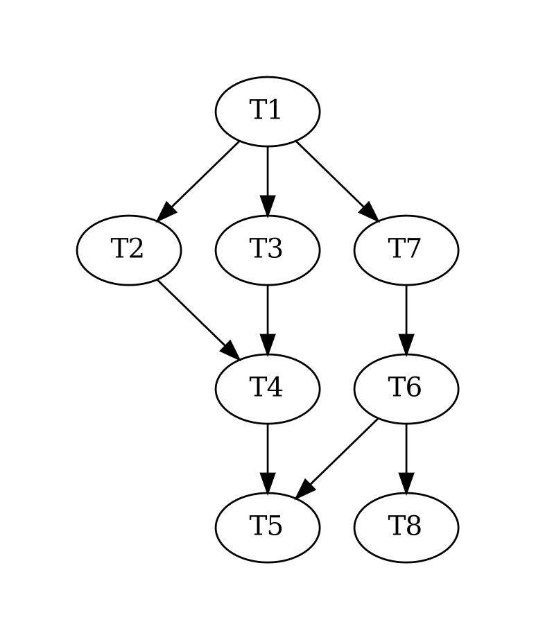

# Instructions  

  ** You will be making a graph data structure. **

  _ Your job will be to make a data structure which lists tasks' dependencies similar to what an operating system would do._

  A graph data structure is commonly used in systems programming to manage tasks.

  Ideas like task prioritization are managed through a graph to maintain order for usage of the operating system's CPU.

  This assignment will challenge you to create a graph data structure with the desired functionality of: adding a node to the graph with a dependency (or dependencies) assigned to it and each node (besides the first) will require a dependency which comes from a privous layer in the graph.


  ## Task input syntax

  ```
  T1 -> {T2, T3, T7}
  T2 -> T4
  T3 -> T4
  T4 -> T5
  T6 -> {T5, T8}
  T7 -> T6
  ```

  The tasks can be named arbitrariliy.  Any C or Java ID is a valid name for a task. For example, George_Thiruvathukal123 or JackWest500 could be a valid task name. The T names above are for conciseness.

  Hint: Use regex. I have an example in the lecture notes.


  

  ## Tasks
  1. Using C, define a data strucutre that emulates functions of a graph.
    1. Adding a node to the graph.
    2. Each node will have the properties of a dependency(Can be Null) and a task number.
    2. Searching for the node in the graph.
    3. Deleting a node in the graph.
    4. Freeing the entire structure.
    5. Editing a specific node.
  2. You must make the data structure in a different file as we will build off of the data structure in future assignments.

  ## Grading
  ** If the makefile does not work you will get a zero.**

  Partial credit will be rewareded to for having some of the aspects working.
  We highly recomend not falling behind; ** the next homework is an application of the data structure you make here. **
  Meaning, if you do not finish the next homework will be much harder.
  Please try to finish this assignment on time.


  <!-- Use [Markdown](https://gist.github.com/cuonggt/9b7d08a597b167299f0d) to format your instructions. -->

  

  <!-- Include an image by placing it in the `assets` folder.

  For example, here is the Replit logo:

  
   -->
  